# README - SOKOBANFX

TO PUBLIC:
This is University of Nottingham Ningbo China Computer Science, Develop Maintainable Software coursework, completed in Dec 2020, made public in Dec, 2021.

- Word count: 282
- Table count: 2
- Graph count: 11

## 1.OO design patterns

### MVC

Separated the view, model and controller. View and model have no directly communication, and they transmit data via controller. 

### Singleton

The following classes can have only one instance

- Class `GameMusic`: only one music file can exists in the program. Using Singleton design pattern here can avoid two or more music playing simultaneously

- Class `GameImage` : can only be loaded once from the source. Using Singleton design pattern can avoid load image more than once for game object, which enhance the speed for the game.

- Class `LevelMemo`: can only have one `LevelMemo` as there cannot be two game playing simultaneously

### Memento Pattern

Class `LevelMemo ` use memento pattern. This class is used to record each move that the player made. The memento can be put in and took out.

### Factory Pattern

Package `GameInitializer` is a set of classes and interface using factory pattern. Class `GameInitializerFactory ` is the factory that produce different type of game Initialiser. 

## 2.Refactoring methodologies

### Game Engine Refactor

As there are two types of  `gameEngine` in the game(single or double player), they use mostly same method in `GameEngine`, so use an abstract class `gameEngine`, which is extended by `gameEngineNormal` and `gameEngineEntertain.

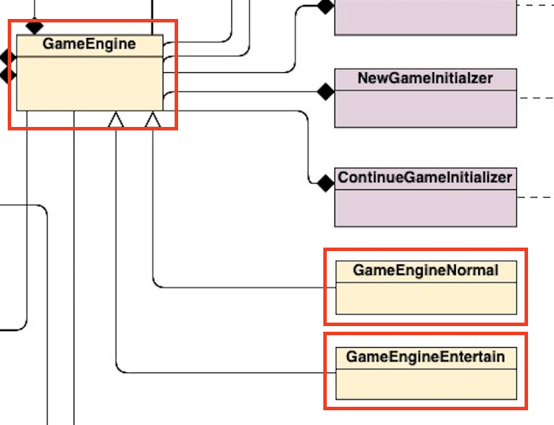

### Refactor GameInitializer

Use a factory for different type of game initialiser, and separated the part of initialise game from controller (`Main `initially). The initialisers return a `gameEngine ` to controller.

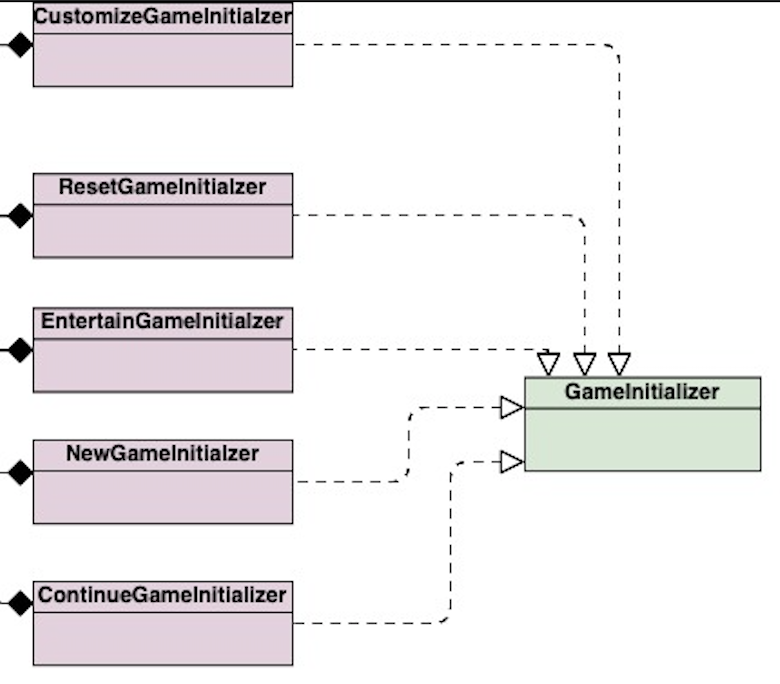

### Separate GameImage, GameMusic

Class `GameImage` and `GameMusic` need get resources from other the resources folder. When refactoring,  separate them into separated class and use singleton design pattern to ensure they have been initialised only once.

### MVC Design

Separate all GUI-related code into FXML file.

## 3. Key changes 

### new feature

| No.  | New feature                                    | Refer to Code change and Reason                              | Refer to Game                                                |
| ---- | ---------------------------------------------- | ------------------------------------------------------------ | ------------------------------------------------------------ |
| 1    | Choose theme and difficulty                    | Class `StartPageController` has two buttons for these e choice. Each Choice has a separated controller, which are `ThemeChoiceController` and `DifficultyChoiceController` | 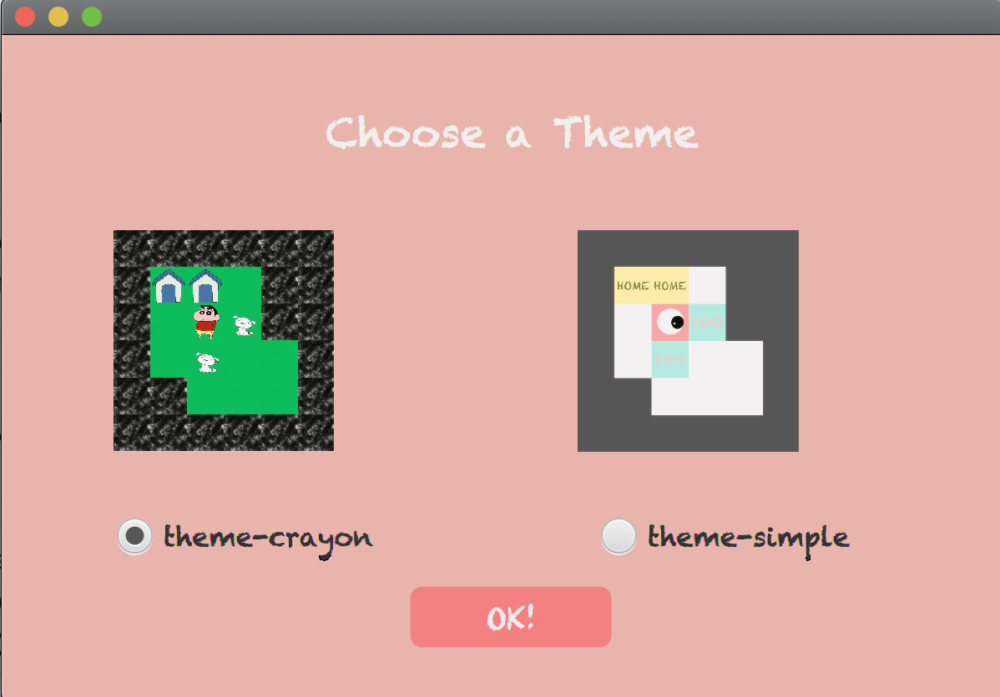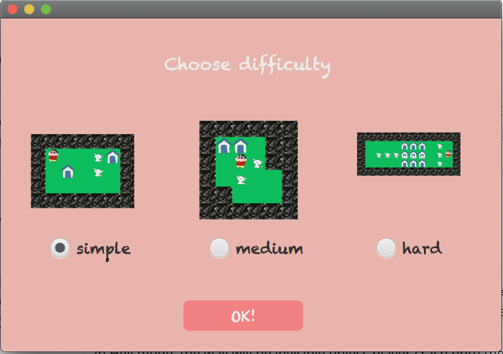 |
| 2    | Ask user enter user name and show in rank list | Class `VictoryController` has method `storePlayerData()` to ask user enter name and save rank.  Class `RankingListController` has method `readRankData()` and `showRank()`to show ranking list. | 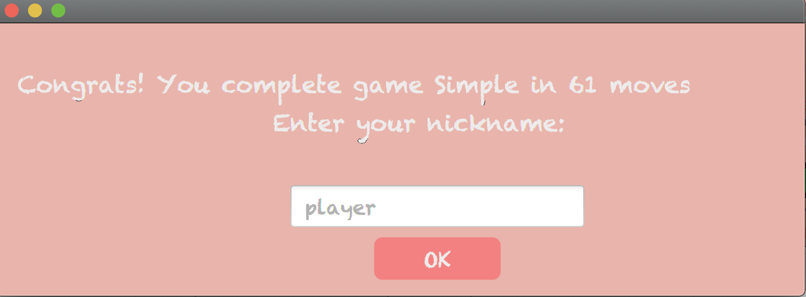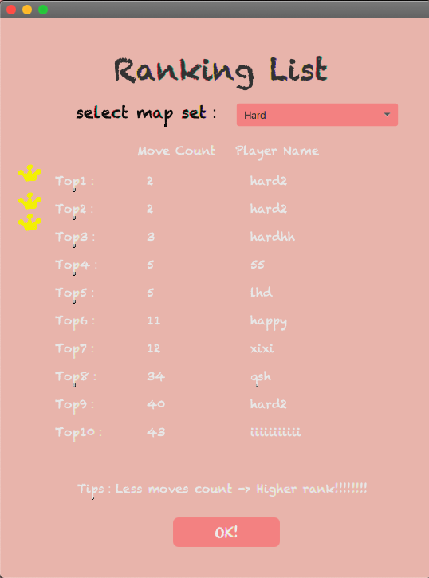 |
| 3    | Entertain game mode (two player)               | For entertain mode, use a separated gameEngine `GameEngineEntertain` to initialize and run the game. It handles operations for both players. | 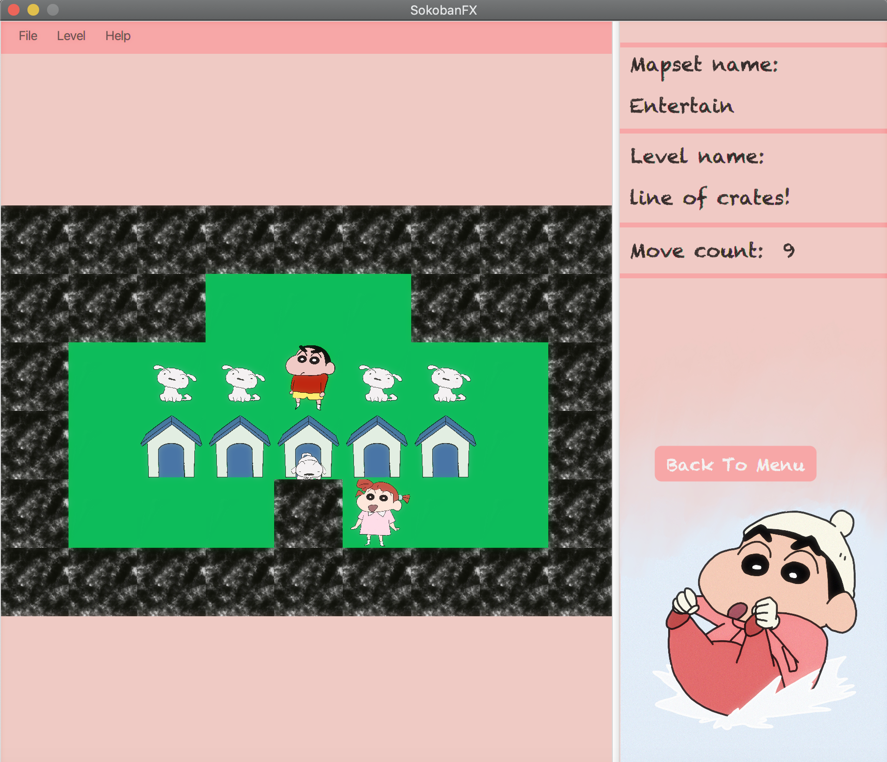 |
| 4    | Hell mode                                      | In Hell mode, the wall will be invisible unless player crash onto them. In class `GameImage`, two methods `hideWallImg()` and `showWallImg()` are used to present the | 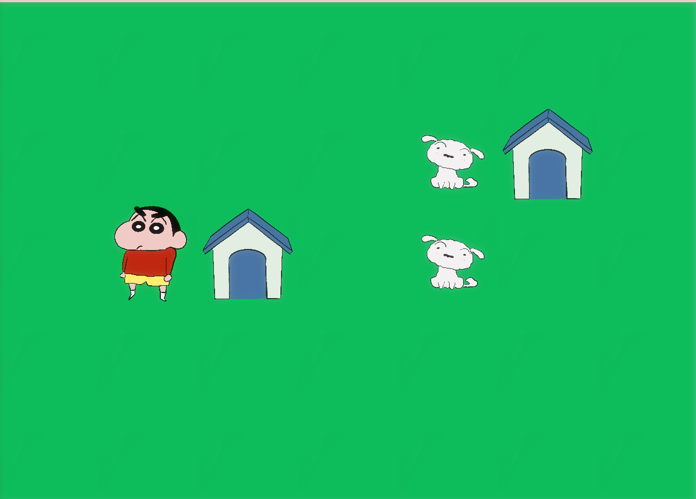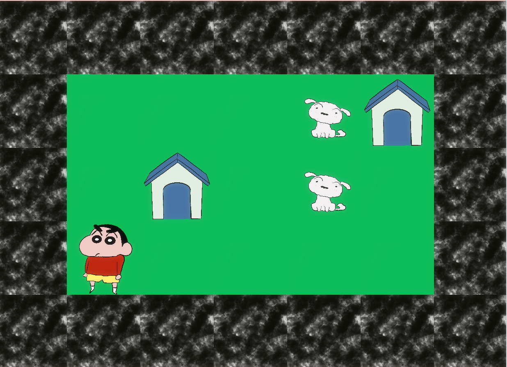 |
| 5    | Review after each round                        | Class `LevelCompleteController` is used to control the review page | 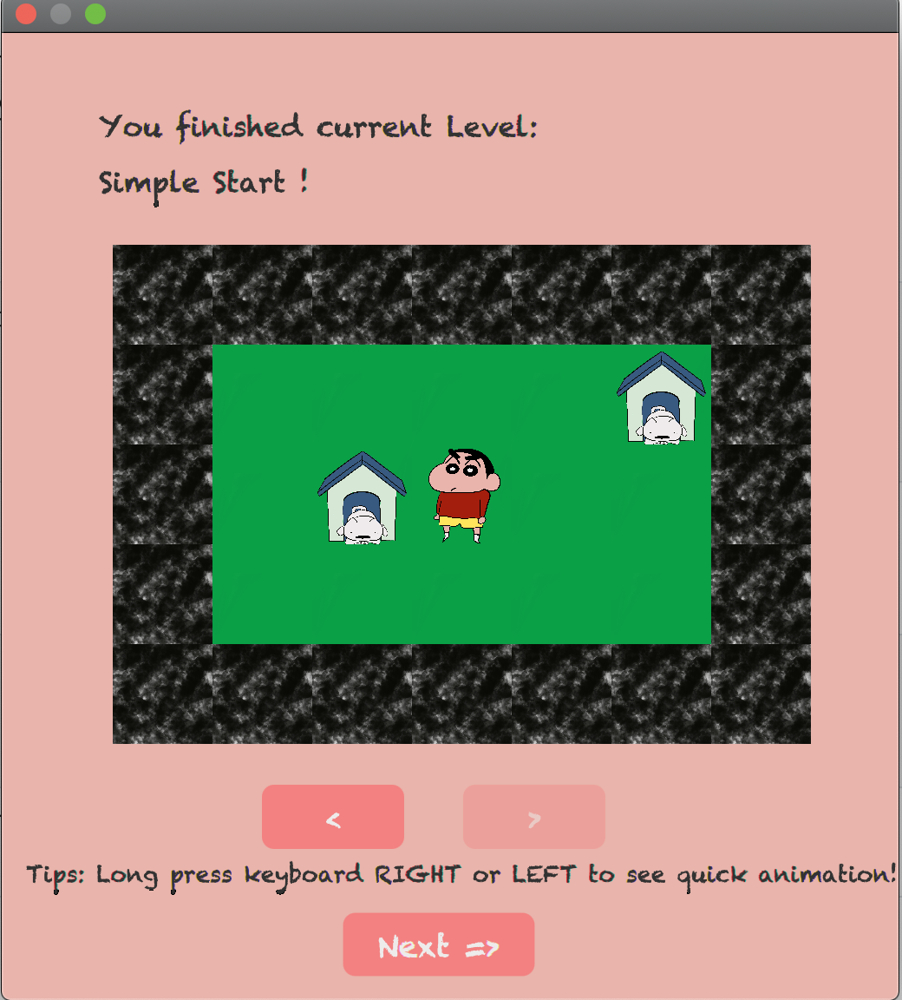 |
| 6    | Add tutorial                                   | Package `TutorialController`                                 | 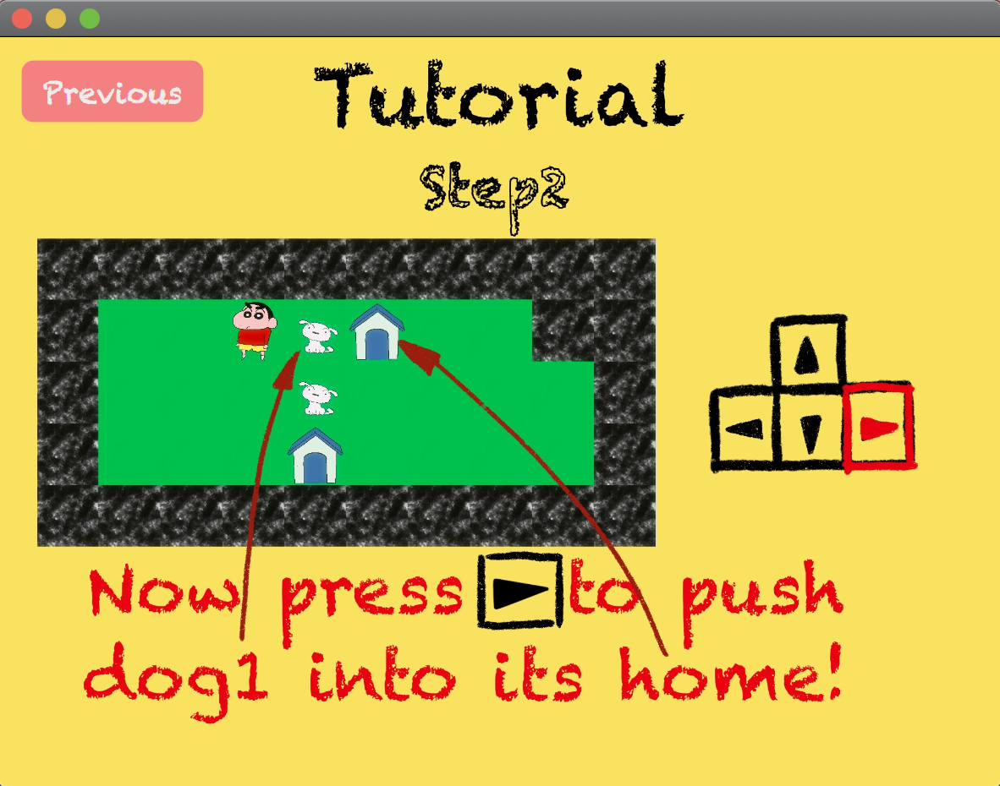 |

### Maintenance 

| No.  | Maintenance Item                                             | type                    | Refer to code                                                | Additional explanation                                       |
| ---- | ------------------------------------------------------------ | ----------------------- | ------------------------------------------------------------ | ------------------------------------------------------------ |
| 1    | Enable `LoadGame` in start page                              | ~re-design              | Class: `StartPageController`  Method: `loadGame()`      | Jump to Game page and call the `loadGame()`in `MainGameController` |
| 2    | Enable `ToggleMusic()` in both start page and main game page | ~re-design              | Class: `StartPageController` `MainGameController` Method: `toggleMusic()` | Use Singleton design pattern, avoid not synchronise when scene changes. |
| 3    | Game grid self-adaption to pane                              | ~UI ~re-design     | Class: `PositionCalculator` Method: All methods         | Cancel window resizable, calculate the object size and grid padding to make the game grid adapt to the pane, and align in the centre of the grid |
| 4    | Change the game object from shape to image                   | ~UI~enhancement         | Class: `GameImage` `GameObject`                         | Load the game image only once to enhance the game speed      |
| 5    | Keeper images depends on direction                           | ~UI~enhancement         | Class:`GameImage` Method:`setEventFilter()`             | Change keeper direction when key code pressed                |
| 6    | Show moves count and level name in game                      | ~enhancement~UI         | Class:`MainGameController` Method:`setEventFilter()`    | Moves count and level name refresh every time the model `GameEngine` changes. |
| 7    | when user cancel load game                                   | ~bug                    | Class:`MainGameController` Method: `loadGane()`         | When the chosen file is null, return.                        |
| 8    | Layouts:`MainGame-layout` `Tutorial-layout` `DifficultyChoice-layout`  should match current theme | ~UI~enhancement         | Class: `GameImage()`,`TutorialController` `DifficultChoiceController` | /                                                            |
| 9    | Cannot get primaryStage after refactoring, need pass parameter | ~bug                    | Class: `MainGameController` `StartPageController`            | As the main game page should start the game immediately, this controller needs to get primary stage. So the `primaryStage` needs to be passed from previous controller. |
| 10   | Show the last step of each round                             | ~bug ~enhancement       | Class: `MainGameController`                                  | Reload grid after each round and wait for 1 sec              |
| 11   | In start page, if there is no game saved, disable the "continue" button | ~bug                    | Class:`StartPageController`                                  | /                                                            |
| 12   | Stage response priority                                      | ~bug                    | Class:`VictoryController` Method:`savePrimaryStage()` `clickOk()` | When the game finished, it should ask user fill in name first, then jump back to the start page |
| 13   | Add a level complete page after each round                   | ~bug ~re-design from 10 | Class:`MainGameController`                                   | Cancel waiting, and show the review Page                     |
| 14   | Add object `KeeperOnDiamond`                                 | ~bug                    | Class:`GameObject`                                           | The saved game status might be keeper on diamond, so this situation needs to be taken in to consider |
| 15   | Back to Start page when game finished                        | ~bug~redesign           | Class: `MainGameController` Class:`VictoryController`   | Back to the Start page when game finished in case that user have no where to go |
| 16   | Enable show about game in both start-page and mainGame page  | ~re-design              | Class:`MainGameController` `StartPageController` Method: `showAbout()` | /                                                            |
| 17   | Remove Listener                                              | ~bug                    | Class: `MainGameController`  `TutorialController`       | Remove the listener when current scene is closed, or may cause the scene have  two listeners. |
| 18   | UI design                                                    | ~re-design              | Class: all                                                   | - change all default UI  - caution with label length    |
| 19   | User loads "Entertain.skb" or reset "Entertain.skb"          | ~bug                    | Class: `StartPageController` `MainGameController` Method: `loadGame()` | When user choose entertain game, the game engine should be `gameEngineEntertain` . Add an if-else statement to avoid bugs |
| 20   | Undo should be disabled after reset level                    | ~bug                    | Class: `MainGameController` Method: `undoStep() ` `resetLevel()` | /                                                            |
| 21   | Cannot read newest change from rank file immediately after save the rank file | ~bug                    | Class: `RankingListController ` Method: `readRankData()` Class:`VictoryController` Method: `storePlayerData()` | Read and store should all use `FileReader` instead of `InputStream`. The stream may have cache problem |
| 22   | When load game, should check if the crate is on diamond      | ~bug                    | Class: `Level` constructor `Level()`                         | /                                                            |
| 23   | Add a listener in review page                                | ~enhancement            | Class: `LevelConpleteController`                             | In review page, user should be able to click and press key code. Long press enables quick review |
| 24   | Undo should be disabled in specific situation                | ~bug                    | Class: `MainGameController` Method: `undoStep()`        | When it is the first step in this level: first into, after reset level, after undo to the first step, after load a new game, undo should be disabled |
| 25   | Cannot copy an object for `levelMemo ` storage, only address. Use deep clone. | ~bug                    | Class `LevelMemo`                                            | Use serialisation to clone an object. Can also use `toString()`, but too many object and too deep level need to be copied. |
| 26   | Handle the situation that user close the stage using system close instead of using button that the game provided | ~bug                    | Class `LevelCompleteController`                              | Use `showAndWait()` to wait the stage closing                |

## 4. Test cases

##### Test log
| Test Id | Test code                   | Code Modification                 |                         Test content                         |               Result               |
| :-----: | --------------------------- | :-------------------------------- | :----------------------------------------------------------: | :--------------------------------: |
|  MGC-1  | `MainGameControllerTest`    | New class `MainGameController`    |     Test whether the back to menu button is on the page      | [+ &nbsp;&nbsp;Pass&nbsp;&nbsp; +] |
|  PST-1  | `PrimaryStageTest`          | New class `StartPageController`   | Test whether all the buttons on start page is set correctly  | [+ &nbsp;&nbsp;Pass&nbsp;&nbsp; +] |
|  RLC-1  | `RankingListControllerTest` | New class `RankingListController` |     Test whether the select text button is set correctly     | [+ &nbsp;&nbsp;Pass&nbsp;&nbsp; +] |
|  GET-1  | `GameEngineTest`            | `GameEngineNormal`                | Test whether the keeper move is correct when there is one player | [+ &nbsp;&nbsp;Pass&nbsp;&nbsp; +] |
|  GET-2  | `GameEngineTest`            | `GameEngineEntertain`             | Test whether the keeper and friend move are correct when there are two players | [+ &nbsp;&nbsp;Pass&nbsp;&nbsp; +] |
